# MacDevelopTools
A Mac application for useful tools, build it just for learning :)

## Some Tips

* Right Click on Status Item can quit App
* Right Click will show Item Manager Controller which can help hide or reorder (useless) Items.

## Contains

* Apple Push Test

  This feature is embed with [Smart Push](https://github.com/shaojiankui/SmartPush "Github") which for Apple Push Testing while developing app. I wanna use it more easier so i embed in this app.

  Preview : 

  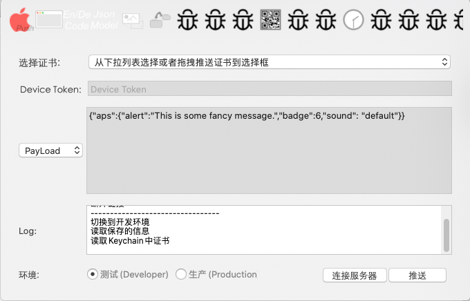

* Wallpaper

  This feature is a try while i want a video wallpaper in macOS. Hint from [wallpaperEngine for Mac](https://github.com/rutti-bep/wallpaperEngine-for-mac "Github").

  Preview : 

  [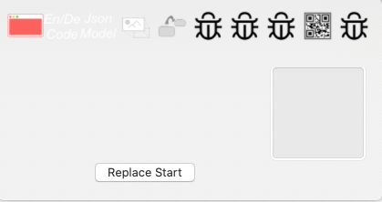](Previews/wallpaper.mp4)

* En/Decode

  This is developed for convinient because xcode always display Chinese in Unicode. And I also add URLEncode in this.

  Preview : 

  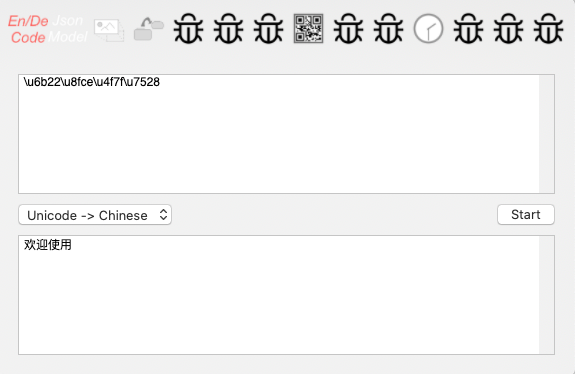

  

* JsonToModel

  This is for translating JSON string to Objective-C class. It also support Swift.Maybe i can add more languages in this.

  Preview : 

  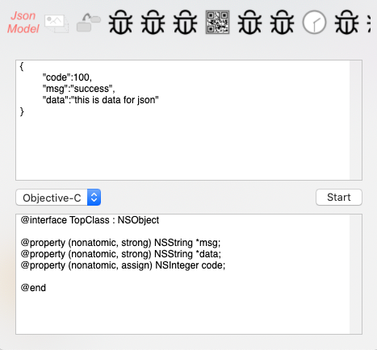

* ResizeImage

  This is for quickly resize lot of images. Maybe have some bugs ? I've only used it a few times.

  Preview : 

  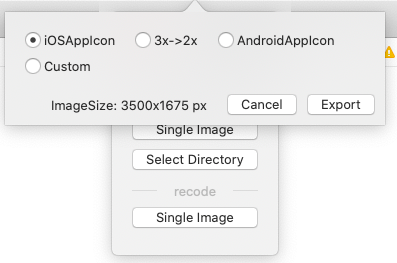

* Move Files

  This is for move files with filter quickly.But macOS Catalina+ can do it inner system.So...

  Preview : 

  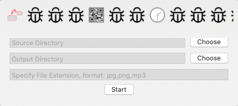

* StatusIcon(not implenment)

  This is for hidden the status bar icon in system. But i have not find the best way to implement it.

* ImageInfo

  This is for checking image info quickly.No much to do.

  Preview : 

  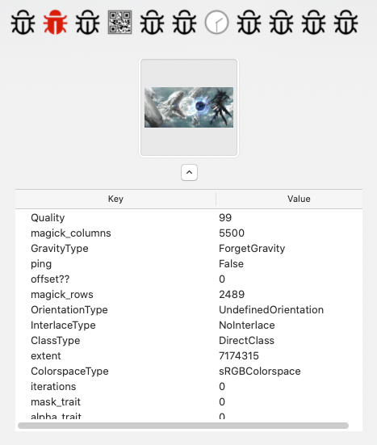

* AutoPack(iOS)

  For packing ipa quickly. Implement by scripts actually.

  Preview : 

  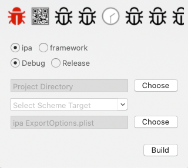

* QRCode

  This is the most useful feature in this app, i think :)

  It can generate/read qrcode easily. It also can capture screen and read info directly.

  Preview : 

  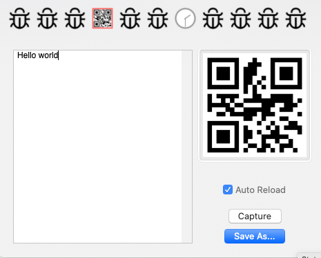

* JSON Format

  This is also useful. It can beauty JSON data and serialize JSON. You can copy key or value easily with selection by hotkey.

  Preview : 

  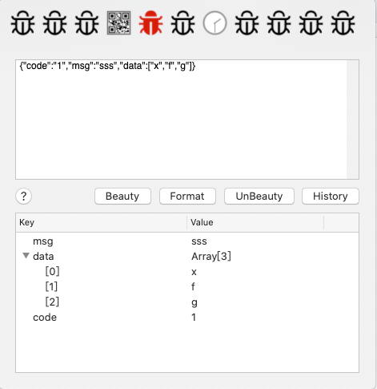

* Shell Manager(implement a little bit)

  This feature is for manager shell windows like putty or finalshell do. It can use but lack of escape code implement.

  Preview : 

  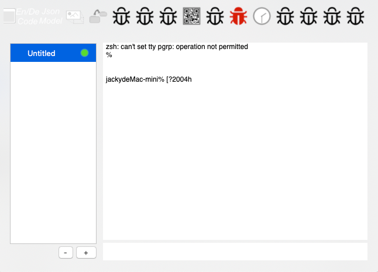

* Clock

  This feature is a notification with custom alert, like drink water notify or take a break notify etc

  Preview : 

  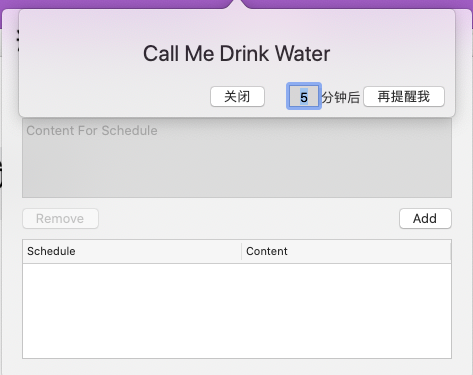

* Lottie Previewer

  This is for easier preview Lottie animation files. You can drag JSON file directly into it. It can also control animation speed、position、size...

  Preview : 

  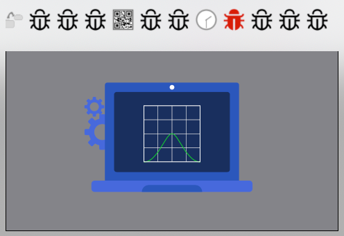

* SVGA Previewer

  The same as Lottie Previewer but it is for SVGA files. Operation is also the same.

* Live2d

  This can create a live2d character into screen. But the library is too old, so it only can run the official example. I have no condition to test the newest one, so i did not update it. Load Example Dir in Project for taking a look.

  Preview:

  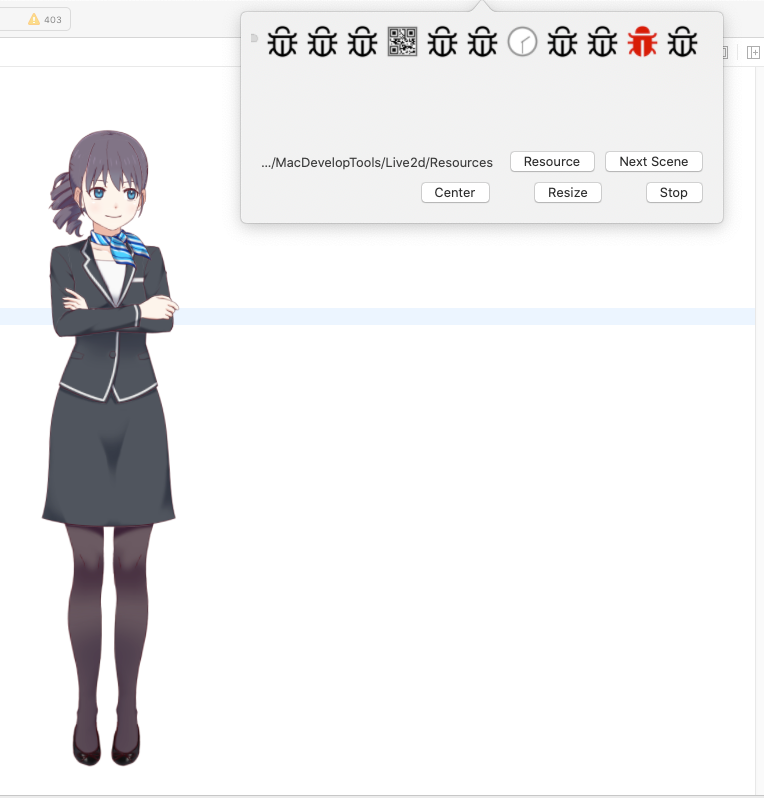

* GoServer 

  This is a remote command excute client for other project [GoServer](https://github.com/spxvszero/jacky_go). if you not fimiliar with this, don't use it.

  Preview : 
  
  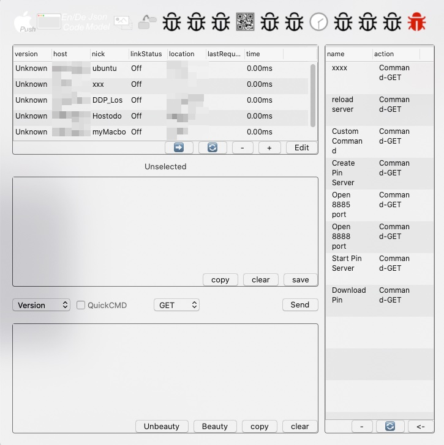
  
* GTranslate

  Embed with google translate. Can also with proxy for using it. 

  Preview:
  
  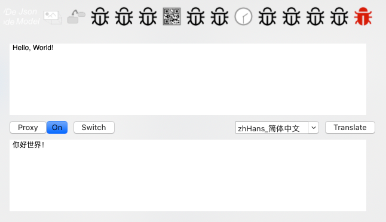

## More Settings
Right Click on Status Bar Icon can open settings.
You can manager the features you want.

  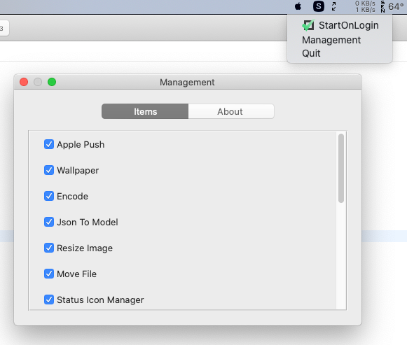

If you want to use StartOnLogin feature. Please move this app into Application folder. Because this is the best way to implement this feature without change user's system settings.

## Thanks For

[Smart Push](https://github.com/shaojiankui/SmartPush "Github")

[wallpaperEngine for Mac](https://github.com/rutti-bep/wallpaperEngine-for-mac "Github")

[ImageMagick](http://www.imagemagick.org/script/index.php "Web Home")

[lottie-ios](https://github.com/airbnb/lottie-ios "Github")

[SVGAPlayer](https://github.com/svga/SVGAPlayer-iOS "Github")